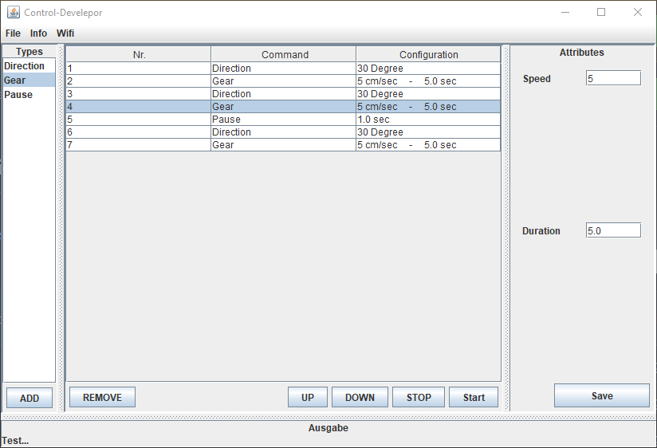

# JAVA GUI

This is a project for the university course Informatik 3 of Reutlingen University.  
This is a JAVA GUI to create and manage a simple program for a robotic vehicle.
There are 3 commands : Direction (turn the vehicle by x degrees), Gear (move formward with v speed and t duration) and Pause (wait for t time).

In the middle is the list of commands that is currently edited.  
On the left are the three commands, that can be added to the list.  
On the right the command parameters can be specified.
On the bottom is a Terminal output, that provides feedback, on what the robot is doing.

The items in the list can be moved and deleted (Full CRUD features (Create Read Update Delete))  

The created lists can be saved as a textfile.  
Saved lists can later be loaded into the GUI.

The textfiles are secured by a salted Hash (HMAC_SHA512).
Due to the salted Hash, a command list saved in plain text on disk can not be maliciously modified without the usage of the GUI and the knowledge of the salt.

The robot is connected via Wifi. The commands are then executed remotely.

